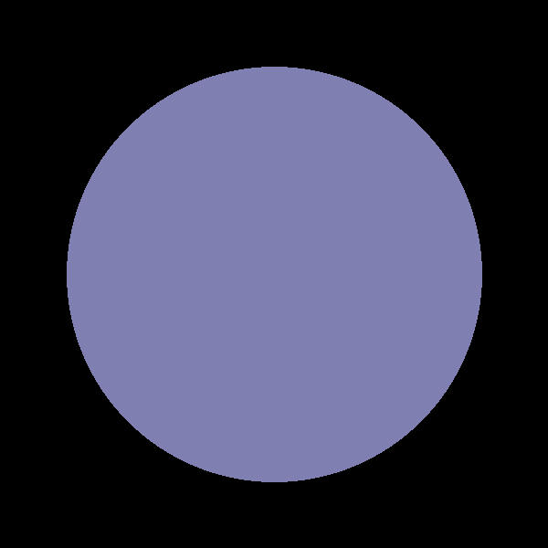
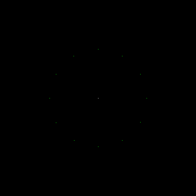

# go-ray-tracer [](https://goreportcard.com/report/github.com/austingebauer/go-ray-tracer) [](https://godoc.org/github.com/austingebauer/go-ray-tracer)

A Go implementation of a 3D renderer using a 
[ray tracing](https://en.wikipedia.org/wiki/Ray_tracing_(graphics)#Algorithm_overview) algorithm.

## Milestones

I'll be adding images of renderings that I create on my journey to write a 3D renderer below.

### 3. Ray Traced Sphere

My third rendering is the first one that is actually ray-traced! It's a circle that was produced by
casting rays at a sphere and filling in colored pixels where an intersection occurred.

The rendering demonstrates the use of a 
[ray-sphere intersection algorithm](https://en.wikipedia.org/wiki/Line%E2%80%93sphere_intersection).

To produce the rendering, run:
```bash
git checkout 195d9b04
go run main.go
open docs/renderings/sphere/sphere.png
```



### 2. Clock Rendering

My second rendering is a clock. The clock has a pixel for each hour of 1-12. 

The rendering demonstrates the use of matrix transforms (e.g., translate, rotate) on points.

To produce the rendering, run:
```bash
git checkout db9f301c
go run main.go
open docs/renderings/clock/clock.png
```



### 1. Projectile Rendering

My very first rendering is a projectile with a starting point, initial velocity, wind, and gravity.

The rendering demonstrates the use of points and vectors.

To produce the rendering, run:
```bash
git checkout 7c481890
go run main.go
open docs/renderings/projectile/projectile.png
```


