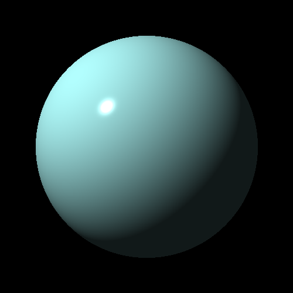
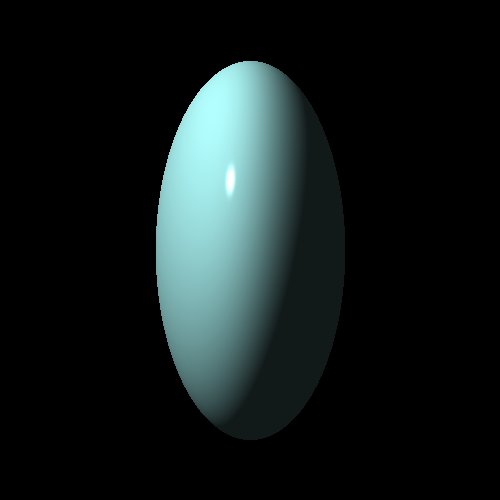
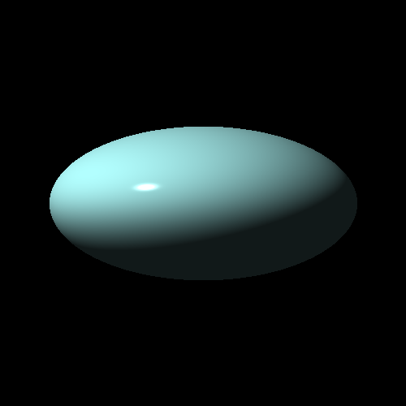
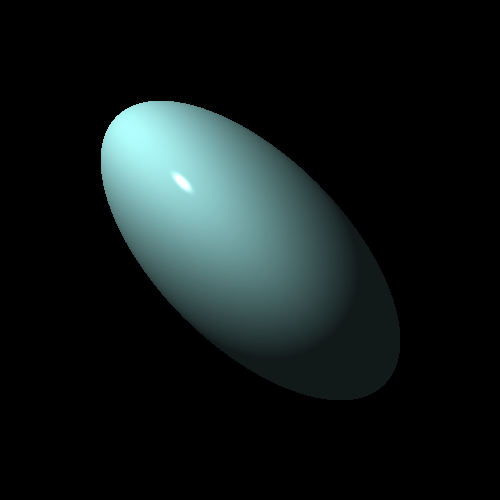
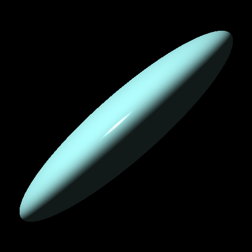
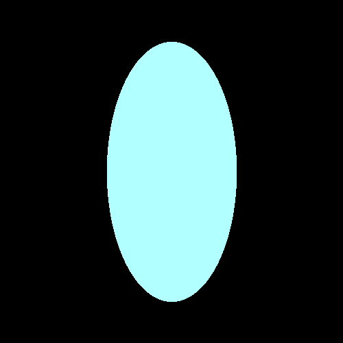
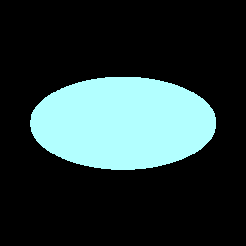
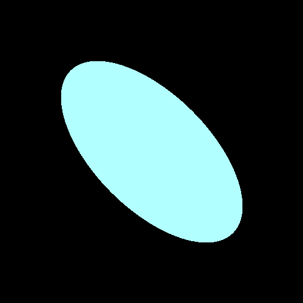
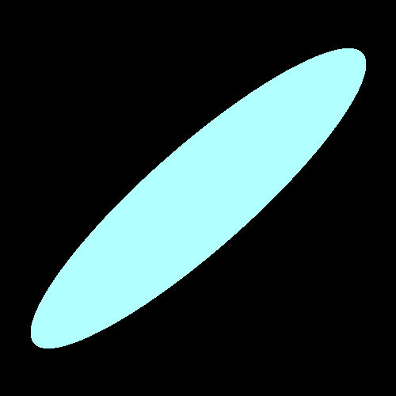

# go-ray-tracer [](https://goreportcard.com/report/github.com/austingebauer/go-ray-tracer) [](https://godoc.org/github.com/austingebauer/go-ray-tracer)

A Go implementation of a 3D renderer using a 
[ray tracing](https://en.wikipedia.org/wiki/Ray_tracing_(graphics)#Algorithm_overview) algorithm.

## Milestones

I'll be adding images of renderings that I create on my journey to write a 3D renderer below.

### 4. Ray Traced Spheres in 3D







### 3. Ray Traced Spheres in 2D

My third rendering is the first one that is actually ray-traced! It's a circle that was produced by
casting rays at a sphere and filling in colored pixels where an intersection occurred.

The rendering demonstrates the use of a 
[line-sphere intersection algorithm](https://en.wikipedia.org/wiki/Line%E2%80%93sphere_intersection) and
transformation matrices (e.g., scaling, rotation, shearing) applied to the spheres.

To produce the renderings, run:
```bash
git checkout 0f43b4d8
go run main.go
open docs/renderings/sphere_2d/sphere_2d.png
open docs/renderings/sphere_2d/sphereScaleX_2d.png
open docs/renderings/sphere_2d/sphereScaleY_2d.png
open docs/renderings/sphere_2d/sphereScaleXRotateZ_2d.png
open docs/renderings/sphere_2d/sphereShearXYScaleX_2d.png
```







### 2. Clock Rendering

My second rendering is a clock. The clock has a pixel for each hour of 1-12. 

The rendering demonstrates the use of matrix transforms (e.g., translate, rotate) on points.

You may need to squint in order to see the hour locations on the clock!

To produce the rendering, run:
```bash
git checkout db9f301c
go run main.go
open docs/renderings/clock/clock.png
```


### 1. Projectile Rendering

My very first rendering is a projectile with a starting point, initial velocity, wind, and gravity.

The rendering demonstrates the use of points and vectors.

To produce the rendering, run:
```bash
git checkout 7c481890
go run main.go
open docs/renderings/projectile/projectile.png
```


