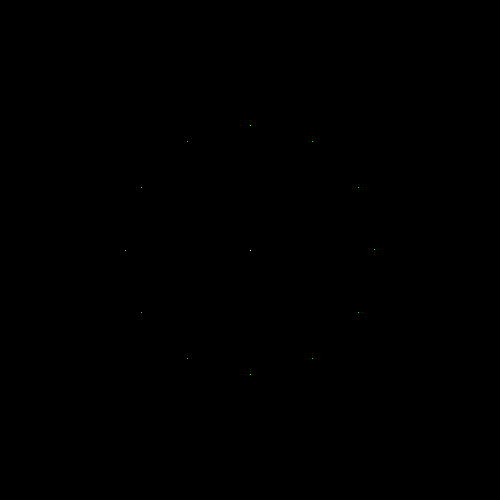

# go-ray-tracer []
(https://godoc.org/github.com/austingebauer/go-ray-tracer)

A Go implementation of a 3D renderer using a 
[ray tracing](https://en.wikipedia.org/wiki/Ray_tracing_(graphics)#Algorithm_overview) algorithm.

## Milestones

I'll be adding images of renderings that I create on my journey to write a 3D renderer below.

### 1. Projectile

My very first rendering is a projectile with a starting point, initial velocity, wind, and gravity.

To produce the rendering, run:
```bash
git checkout 7c481890
go run main.go
open renders/projectile/projectile.ppm
```


### 1. Clock

My second rendering is a clock. The clock has a pixel for each hour of 1-12. 

The rendering demonstrates different types of transforms (e.g., translate, rotate) on points.

To produce the rendering, run:
```bash
git checkout 7c481890
go run main.go
open renders/projectile/projectile.ppm
```


