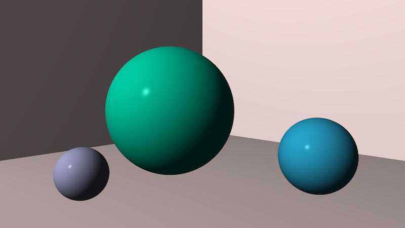
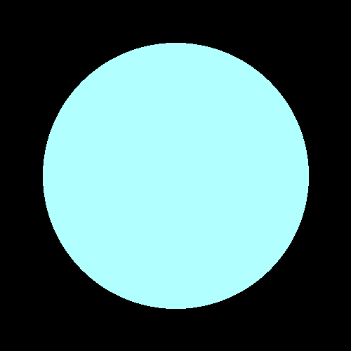

# go-ray-tracer [](https://goreportcard.com/report/github.com/austingebauer/go-ray-tracer) [](https://godoc.org/github.com/austingebauer/go-ray-tracer)

A Go implementation of a 3D renderer using a 
[ray tracing](https://en.wikipedia.org/wiki/Ray_tracing_(graphics)#Algorithm_overview) algorithm.

## Milestones

I'll be adding images of renderings that I create on my journey to write a 3D renderer below.

### 5. Ray Traced World

My fifth rendering is a ray traced world which includes 3 spheres sitting in a room with walls.

The rendering demonstrates the implementation of a camera with a 
[field of view](https://en.wikipedia.org/wiki/Angle_of_view) and view transformation matrix. 
The view transformation matrix orients the camera by specifying where to look *from* and *to*, and
which way is *up*.

I found the following to be good reads for more on view transformation matrices:
- [World, View and Projection Transformation Matrices](http://www.codinglabs.net/article_world_view_projection_matrix.aspx)
- [Understanding the View Matrix](https://www.3dgep.com/understanding-the-view-matrix/)

To produce the rendering, run:
```bash
git checkout 2c4b679d
go run main.go
```



### 4. Ray Traced Spheres in 3D

My fourth rendering is my first ever 3D rendering! Producing a 3D rendering was one of those moments that
felt like magic. Those are the moments that keep me excited about programming.

The rendering demonstrates the use of the 
[phong reflection model](https://en.wikipedia.org/wiki/Phong_reflection_model) for pixel shading, computing 
normal vectors on a sphere, and vector reflection.  

To produce the renderings, run:
```bash
git checkout 2a062177
go run main.go
```


### 3. Ray Traced Spheres in 2D

My third rendering is the first one that is actually ray-traced! It's a circle that was produced by
casting rays at a sphere and filling in colored pixels where an intersection occurred.

The rendering demonstrates the use of a 
[line-sphere intersection algorithm](https://en.wikipedia.org/wiki/Line%E2%80%93sphere_intersection) and
transformation matrices (e.g., scaling, rotation, shearing) applied to the spheres.

To produce the renderings, run:
```bash
git checkout 0f43b4d8
go run main.go
```




### 2. Clock Rendering

My second rendering is a clock. The clock has a pixel for each hour of 1-12. 

The rendering demonstrates the use of matrix transforms (e.g., translate, rotate) on points.

You may need to squint in order to see the hour locations on the clock!

To produce the rendering, run:
```bash
git checkout db9f301c
go run main.go
```


### 1. Projectile Rendering

My very first rendering is a projectile with a starting point, initial velocity, wind, and gravity.

The rendering demonstrates the use of points and vectors.

To produce the rendering, run:
```bash
git checkout 7c481890
go run main.go
```


